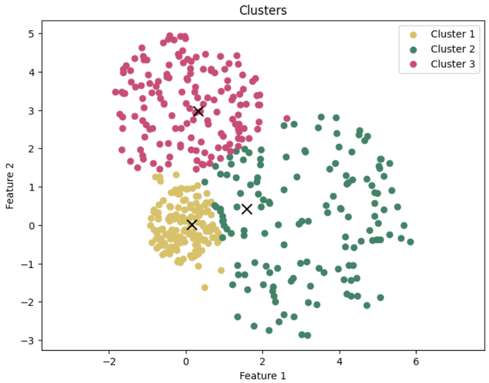

===============
Getting Started
===============

Welcome to algoFuzz, a framework for popular fuzzy c-means clustering algorithms from literature. This guide will walk you through the basics of using algoFuzz, from installation to running your first clustering algorithm.

Prerequisites
---------------------------------
Before you start using the algoFuzz library, ensure that you have the following prerequisites:

- **Python 3.8+** installed on your system.
- Familiarity with clustering concepts.
- A basic understanding of Python programming.

Installation
---------------------------------
To install the library, simply use the following ``pip`` command:

.. code-block:: bash

   pip install algofuzz

Alternatively, you can also install the library directly from the source if it's hosted on GitHub or a similar platform:

.. code-block:: bash

   git clone https://github.com/naghim/algofuzz
   cd algofuzz
   pip install .

Make sure to check the `official repository <https://github.com/naghim/algofuzz>`_ for the latest updates and releases.

Quick example
-------------

Here's a basic example of how to use the Fuzzy C-Means (FCM) algorithm to cluster data.

Imports
=======

For starters, let's import the necessary classes. You can use the following code snippet to get started:

.. code-block:: python

   from algofuzz import FCM
   from algofuzz import CentroidStrategy, DatasetType, load_dataset, generate_colors
   import numpy as np
   import matplotlib.pyplot as plt
   import random

Your imports may be different depending on the specific algorithm you are using.

Loading a dataset
=================

Next, let's load a dataset to work with. You can use the ``load_dataset`` function to load a toy dataset from the library. You can also replace this with your own dataset. Datasets can be more or less substituted with simple numpy arrays.

**Note**: The ``load_dataset`` function returns the data points, number of clusters, and true labels for the dataset.

**Warning**: If you are using your own dataset, make sure to ensure that the dimensions of the data points are consistent with the algorithm you are using. It might be necessary to transpose the data (``data.T``) before passing it to the algorithm.

.. code-block:: python

   # Choose a random seed for reproducibility
   np.random.seed(0)

   # Load the Bubbles toy dataset
   # You can replace this with your own dataset as well
   data, num_clusters, true_labels = load_dataset(DatasetType.Bubbles)

   # There are 3 clusters
   print(f'Number of clusters: {num_clusters}')

Choosing a clustering algorithm
===============================

Now, let's choose a clustering algorithm to segment the data. You may choose from the following algorithms currently available in the library:

1. :py:mod:`algofuzz.fcm.fcm`: Fuzzy C-Means (FCM) algorithm, proposed by Dunn in 1973 and improved by Bezdek in 1981.
2. :py:mod:`algofuzz.fcm.possibilistic_fcm`: Possibilistic Fuzzy C-Means Clustering algorithm proposed by Pal et al. in 2005.
3. :py:mod:`algofuzz.fcm.eta_fcm`: An extension of the FCM model that includes a penalty term (eta) for each cluster depending on the distance between the data points and the centroids of the clusters.
4. :py:mod:`algofuzz.fcm.fcplus1m`: A Fuzzy C-Means algorithm with an extra noise cluster proposed by R. Dave in 1993.
5. :py:mod:`algofuzz.fcm.nonoptimized_fp3cm`: Fuzzy Possibilistic Product Partition C-Means Clustering algorithm proposed by L. Szilágyi & S. Szilágyi in 2014.
6. :py:mod:`algofuzz.fcm.nonoptimized_fpcm`: Fuzzy-Possibilistic C-Means Clustering algorithm proposed by Pal, Pal and Bezdek in 1997.
7. :py:mod:`algofuzz.fcm.stpfcm`: Self-tuning version of the Possibilistic Fuzzy C-Means Clustering algorithm proposed by MB. Naghi in 2023.

To use any of these algorithms, you can import them as follows:

.. code-block:: python
   
   from algofuzz import FCM
   from algofuzz import PFCM
   from algofuzz import EtaFCM
   from algofuzz import FCPlus1M
   from algofuzz import NonOptimizedFP3CM
   from algofuzz import NonOptimizedFPCM
   from algofuzz import STPFCM

Now, let's create an instance of the FCM algorithm and fit it to the data. We will use the ``fit`` method to compute the clusters and membership values based on the input data.

To finetune the algorithm, you can set the parameters such as the number of clusters, maximum number of iterations, and other parameters when creating the algorithm object. Please check the documentation of the chosen algorithm for more details.

.. code-block:: python

   # Create an FCM model with 3 clusters, choosing random initial centroids
   fcm = FCM(
      num_clusters=num_clusters,
      max_iter=100,
      centroid_strategy=CentroidStrategy.Random
   )

Fitting the data
================

Next, we fit the model to the data using the ``fit`` method. This will compute the clusters and membership values based on the input data.

.. code-block:: python

   # Fit the model to the data
   fcm.fit(data)

   # These are the centroids of the clusters
   centers = fcm.centroids

   # These are the labels assigned to each data point (there are 3 clusters)
   labels = fcm.labels

Visualizing the clusters
========================

Finally, we visualize the clusters using a scatter plot. We generate random colors for each cluster and plot the data points along with the cluster centers.

.. code-block:: python

   # Plot the clusters
   colors = generate_colors(num_clusters)
   plt.figure(figsize=(8, 6))

   for i in range(num_clusters):
      cluster_points = data[:, labels[:data.shape[1]] == i]
      plt.scatter(cluster_points[0], cluster_points[1], c=colors[i], label=f'Cluster {i+1}')

   for i in range(num_clusters):
      plt.scatter(centers[0][i], centers[1][i], marker='x', c='black', s=100)

   plt.xlabel('Feature 1')
   plt.ylabel('Feature 2')
   plt.title('Clusters')
   plt.legend()
   plt.axis('equal')
   plt.show()

Further reading
---------------

Visit the :ref:`theoreticalbackground` page for more information about this topic.

Need help?
----------

If you encounter any issues or need further clarification, feel free to reach out via:

- `GitHub Issues <https://github.com/naghim/algofuzz/issues>`_ for bug reports and feature requests.
- `Discord Community Server <https://discord.gg/7rDajmdEPV>`_ for discussions and troubleshooting.
